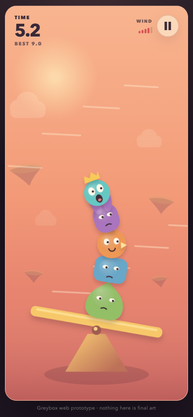

# Wobble Stack

Keep one to five little disasters together while the wind tries to tear the tower apart.

[**Play Wobble Stack**](https://kiku-jw.github.io/wobble-stack/) · Touch, mouse, and keyboard

[](https://github.com/kiku-jw/wobble-stack/actions/workflows/deploy-pages.yml)

<p align="center">
  
</p>

## What it is

Wobble Stack is a tiny portrait physics game built to test one idea: can a
single thumb create a satisfying cycle of calm, wobble, panic, save, collapse,
and instant retry?

This is a playable greybox, not a finished game. It deliberately has no
accounts, backend, progression, shop, ads, analytics, or final character art.

## Controls

- **Touch or mouse:** press anywhere in the game and move left or right.
- **Keyboard:** use Left/Right or A/D.
- **Goal:** lean opposite the wind and keep every creature on the beam as gusts get stronger.
- **Pause:** use the button in the top-right corner or press Escape.

Before each run you can choose Gentle, Normal, or Wild wind and a stack of one
to five creatures. Best times are tracked separately for every combination.

## Run locally

Requirements: Node.js 22 and pnpm 10.

```sh
pnpm install --frozen-lockfile
pnpm dev
```

The development server prints the local URL. The production checks are:

```sh
pnpm test
pnpm build
```

## How it works

- Matter.js provides gravity, collision, and rigid-body motion.
- A custom Canvas renderer draws the stage and up to five characters.
- Pointer and keyboard input control one target angle for the beam.
- Seeded, telegraphed gusts ease in and increase pressure over time.
- The warning shows where the wind pushes and which way to lean.
- Collapse continues in slow motion, and each creature reacts when it hits the ground.
- Per-setup best times and the last setup are stored locally; nothing is sent anywhere.

## Visual direction

These generated frames are targets for a possible native version, not
screenshots of the current web prototype.

<p align="center">
  
  
</p>

The next gate is a fresh-player test: do people understand the control, explain
why they lost, and voluntarily press Retry? Final art and meta systems stay out
until that evidence exists.

## License

[MIT](LICENSE) © 2026 [Nick / kiku-jw](https://github.com/kiku-jw)
