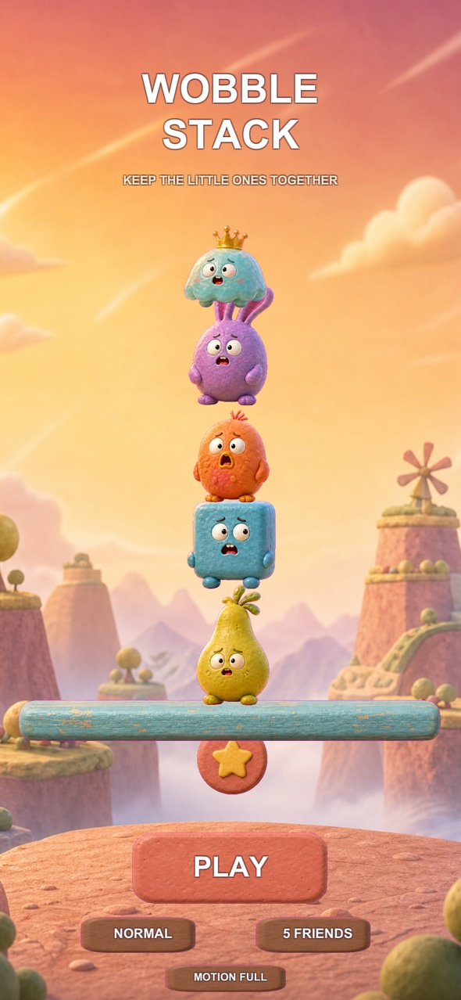
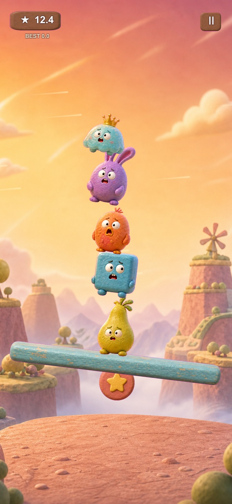
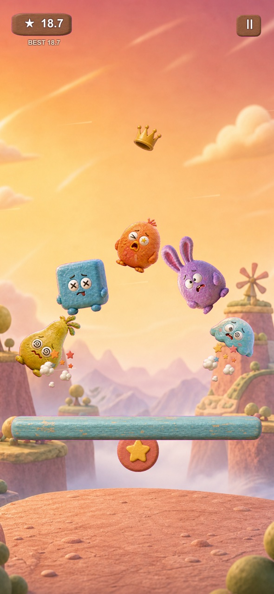
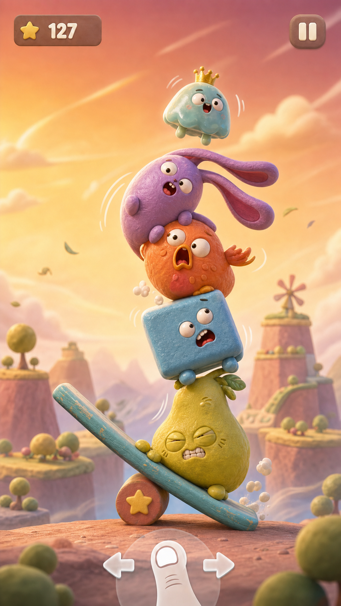
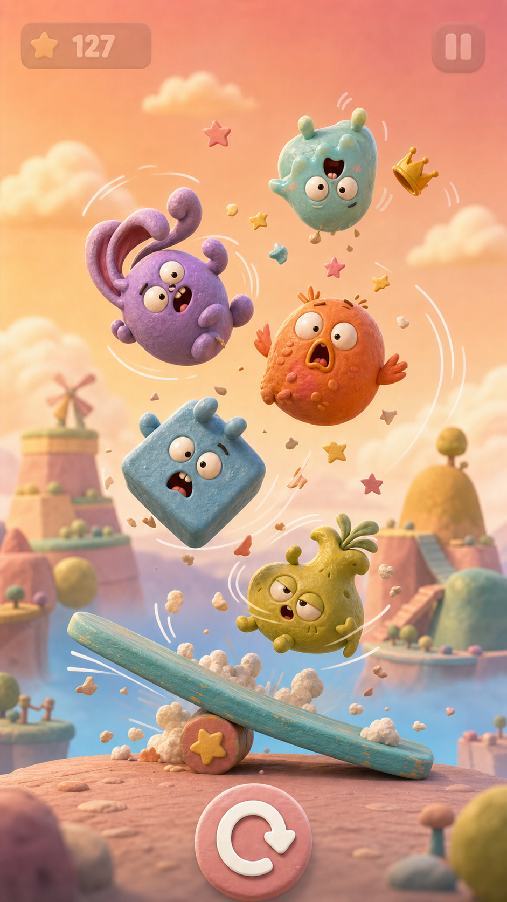

# Wobble Stack

Keep three to five little disasters together while the wind tries to tear the tower apart.

[**Play the web prototype**](https://kiku-jw.github.io/wobble-stack/) · Touch, mouse, and keyboard

[](https://github.com/kiku-jw/wobble-stack/actions/workflows/deploy-pages.yml)

<p align="center">
  
  
  
</p>

## What it is

Wobble Stack is a portrait physics game built around one idea: can a single
thumb create a satisfying cycle of calm, wobble, panic, save, collapse, and
instant retry?

The public GitHub Pages build remains the lightweight Matter.js prototype. The
production iPhone client now lives in `ios/WobbleStack`: a Unity 6 vertical
slice with clay character art, deterministic gusts, three difficulty profiles,
three-to-five-creature setups, pause/results/Retry flows, local best scores,
impact slow motion, changing impact faces, generated sound, haptic hooks,
reduced motion, safe areas, and a finished app icon.

## Controls

- **Touch or mouse:** press anywhere in the game and move left or right.
- **Keyboard:** use Left/Right or A/D.
- **Goal:** lean opposite the wind and keep every creature on the beam as each gust builds.
- **Pause:** use the button in the top-right corner or press Escape.

Before each run you can choose Gentle, Normal, or Wild wind and a stack of three
to five creatures. Best times are tracked separately for every combination.

## Run the web prototype locally

Requirements: Node.js 22 and pnpm 10.

```sh
pnpm install --frozen-lockfile
pnpm dev
```

The development server prints the local URL. The production checks are:

```sh
pnpm test
pnpm build
```

## How it works

- Matter.js provides gravity, collision, and rigid-body motion.
- A custom Canvas renderer draws the stage and up to five characters.
- Pointer and keyboard input control one target angle for the beam.
- Seeded gusts vary inside distinct difficulty ranges and build through visible wind streaks.
- Moving wind streaks show direction while their speed, density, and opacity build with force.
- Creatures fall at normal speed; the first ground impact triggers a brief slow-motion beat.
- Per-setup best times and the last setup are stored locally; nothing is sent anywhere.

## iPhone client

The Unity project is pinned to `6000.3.19f1` at `ios/WobbleStack`. Configure it
and run its automated checks with:

```sh
UNITY="/Applications/Unity/Hub/Editor/6000.3.19f1/Unity.app/Contents/MacOS/Unity"

"$UNITY" -batchmode -quit -nographics \
  -projectPath "$PWD/ios/WobbleStack" \
  -executeMethod WobbleStack.Editor.WobbleStackProjectBootstrap.ConfigureProject

"$UNITY" -batchmode -nographics \
  -projectPath "$PWD/ios/WobbleStack" \
  -runTests -testPlatform EditMode \
  -testResults /tmp/wobble-editmode.xml

"$UNITY" -batchmode -nographics \
  -projectPath "$PWD/ios/WobbleStack" \
  -runTests -testPlatform PlayMode \
  -assemblyNames WobbleStack.Runtime.PlayMode.Tests \
  -testResults /tmp/wobble-playmode.xml
```

`Wobble Stack/Build Mac Smoke` creates a local executable for desktop smoke
testing. `Wobble Stack/Build iOS Development` exports an Xcode project once the
matching Unity iOS Build Support module is installed. Signing, device testing,
and TestFlight still require full Xcode and an Apple development team.

Detailed product, art, architecture, and test decisions live in [`docs/ios`](docs/ios/PRD.md).

## Visual direction

The concept frames below established the target. The iPhone screenshots at the
top of this README are rendered from the current Unity build.

<p align="center">
  
  
</p>

The next gate is a physical iPhone test: stable feel and frame pacing, correct
safe areas and haptics, fresh-player comprehension, and voluntary Retry. Meta
systems stay out until that evidence exists.

## License

[MIT](LICENSE) © 2026 [Nick / kiku-jw](https://github.com/kiku-jw)
