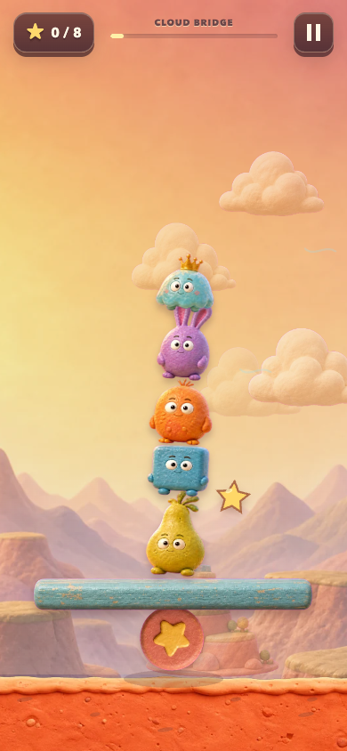
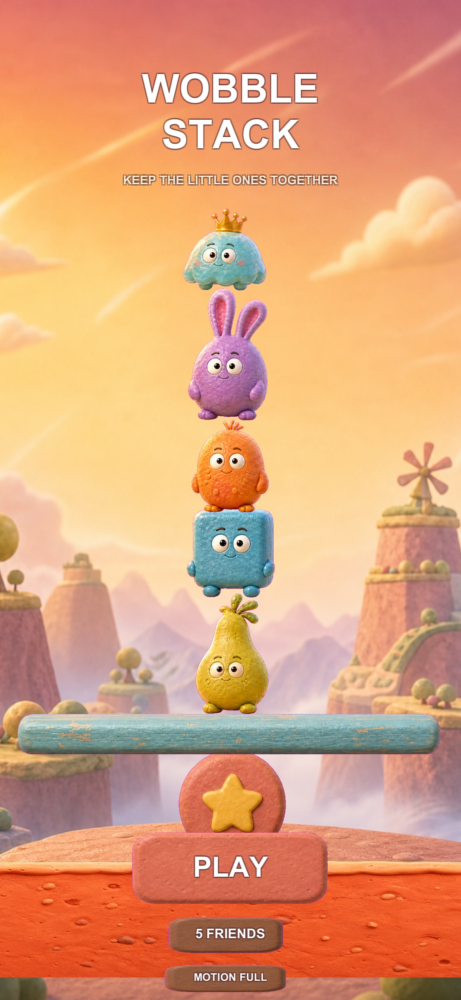
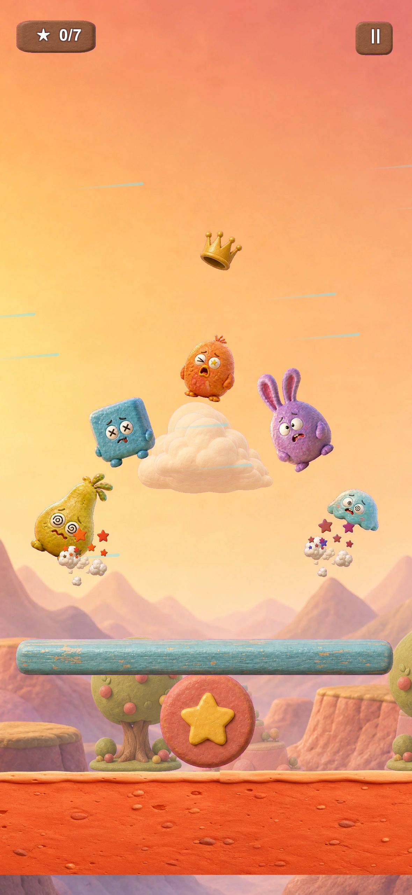
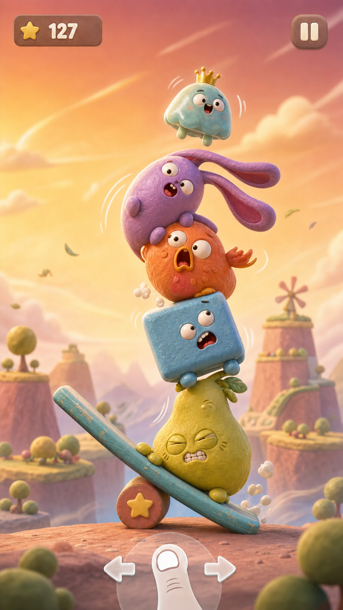
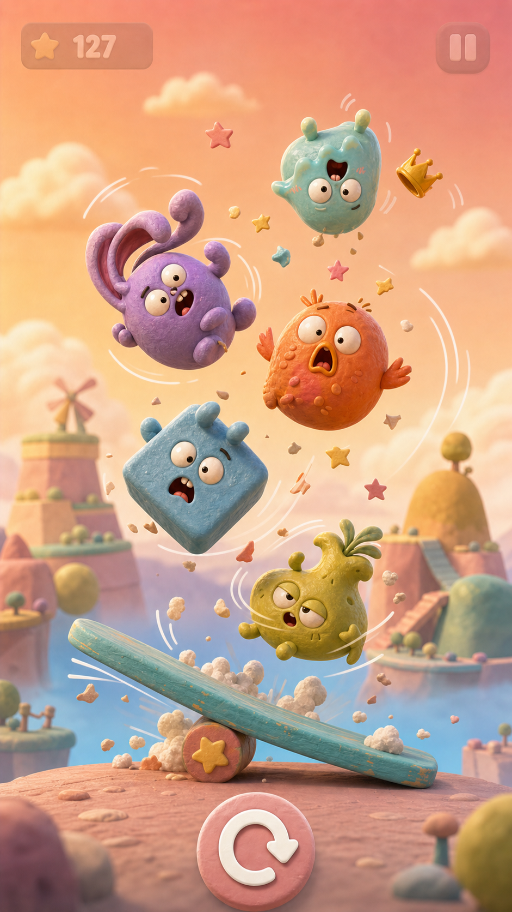

# Wobble Stack

Roll one ridiculous wheel under five little disasters while the wind tries to
tear the tower apart.

[**Play Wobble Stack**](https://kiku-jw.github.io/wobble-stack/) · Touch, mouse, and keyboard

[](https://github.com/kiku-jw/wobble-stack/actions/workflows/deploy-pages.yml)

<p align="center">
  
  
  
</p>

## What it is

Wobble Stack is a portrait physics game built around one idea: can a single
thumb create a satisfying cycle of calm, wobble, panic, save, collapse, and
instant retry?

The GitHub Pages edition now carries the actual game loop: a grounded star
wheel, a moving clay road, three finite journeys, variable wind, 7/8/9 festival
badges, authored bumps, two first-route friend joins, character-specific
emotions, comic impact poses, first-impact slow motion, pause, Retry, local
unlock progress, four shuffled parade tracks, and responsive touch/keyboard
controls.

The Unity 6 iPhone client lives in `ios/WobbleStack`. It keeps the more detailed
native joint animation, sound, and haptics while sharing the same story, routes,
art direction, and wheel-balance contract. Neither edition requires an account
or backend.

## Controls

- **iPhone:** touch anywhere outside UI, then slide left or right from that
  touch-down point to roll the wheel. Use short counter-slides to put the wheel
  back under a developing lean; wider slides visibly shift its support beneath
  the plank. Release to resume the gentle forward roll.
- **Browser:** touch or click anywhere on the stage, then slide relative to
  that point to roll the wheel under the falling side. Release to recenter.
  Left/Right and A/D use the same wheel movement.
- **Goal:** reach the windmill with every creature and collect festival badges
  by touching them with the living stack.
- **Pause:** use the button in the top-right corner or press Escape.
- **Music:** starts after Play, defaults to 50%, and can be adjusted from the
  road selector or pause menu. The preference stays on the device.

There is one game mode: every gust independently samples a different intensity,
and the wind itself—not a meter or difficulty label—shows how strong it is.
The first route will begin with three friends and add Rabbit and Jelly King at
safe stops. Completing a route records its best badge count and opens the next
road.

## Run the browser game locally

Requirements: Node.js 22 and pnpm 10.

```sh
pnpm install --frozen-lockfile
pnpm dev
```

The development server prints the local URL. The production checks are:

```sh
pnpm test
pnpm build
```

## How it works

- Matter.js provides gravity, collision, and rigid-body motion.
- A custom Canvas renderer draws the stage and up to five characters.
- Relative pointer input moves the visible wheel beneath the plank; its support
  position drives the bounded plank response. Keyboard control uses the same
  support model.
- Seeded gusts vary inside one continuous force range biased toward ordinary
  Normal-like wind, with occasional soft and strong outliers.
- Moving wind streaks show direction while their speed, density, and opacity build with force.
- Creatures fall at normal speed; the first ground impact triggers a brief slow-motion beat.
- One native audio player walks a shuffled four-track playlist without an
  immediate repeat between shuffle cycles.
- Three authored routes store unlocks and best badge counts locally; nothing is
  sent anywhere.

## iPhone client

The Unity project is pinned to `6000.3.19f1` at `ios/WobbleStack`. Configure it
and run its automated checks with:

```sh
UNITY="/Applications/Unity/Hub/Editor/6000.3.19f1/Unity.app/Contents/MacOS/Unity"

"$UNITY" -batchmode -quit -nographics \
  -projectPath "$PWD/ios/WobbleStack" \
  -executeMethod WobbleStack.Editor.WobbleStackProjectBootstrap.ConfigureProject

"$UNITY" -batchmode -nographics \
  -projectPath "$PWD/ios/WobbleStack" \
  -runTests -testPlatform EditMode \
  -testResults /tmp/wobble-editmode.xml

"$UNITY" -batchmode -nographics \
  -projectPath "$PWD/ios/WobbleStack" \
  -runTests -testPlatform PlayMode \
  -assemblyNames WobbleStack.Runtime.PlayMode.Tests \
  -testResults /tmp/wobble-playmode.xml
```

`Wobble Stack/Build Mac Smoke` creates a local executable for desktop smoke
testing. `Wobble Stack/Build iOS Device` exports a non-Development Xcode project
with the matching Unity iOS Build Support module. The current arm64 build is
signed, installed, and launch-verified on the development iPhone. TestFlight
still requires Apple Developer Program and App Store Connect access.

Detailed product, art, architecture, and test decisions live in [`docs/ios`](docs/ios/PRD.md).

## Visual direction

The concept frames below established the target. The browser capture and iPhone
screenshots at the top are rendered from the current implementations.

<p align="center">
  
  
</p>

The native production slice now passes deterministic rolling, strongest-gust,
friend-join, badge, finish, parallax, articulation, and collapse checks plus
inspected portrait Metal captures. The signed-device pipeline is proven, but a
fresh physical-iPhone feel pass remains mandatory after every material control
change.

## License

[MIT](LICENSE) © 2026 [Nick / kiku-jw](https://github.com/kiku-jw)

<!-- author-links:start -->
<p align="center">
  <a href="https://kikuai.dev/"></a>
  <a href="https://t.me/kiku_ai"></a>
  <a href="https://github.com/kiku-jw"></a>
</p>
<p align="center">
  <sub>Follow new projects and updates from <a href="https://github.com/kiku-jw">@kiku-jw</a>.</sub>
</p>
<!-- author-links:end -->
