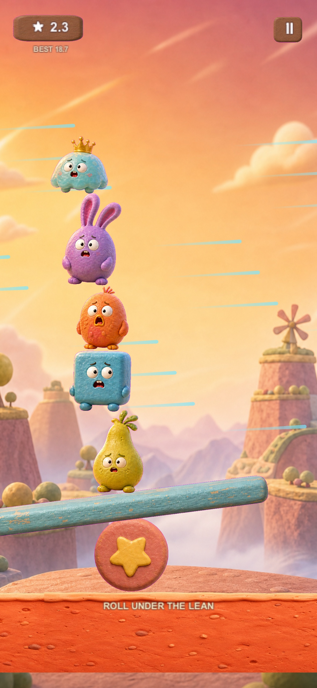
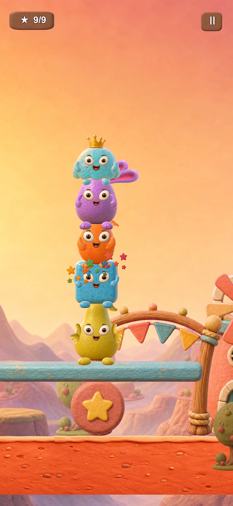

# Wobble Stack

Roll one ridiculous wheel under five little disasters while the wind tries to
tear the tower apart.

[**Play the web prototype**](https://kiku-jw.github.io/wobble-stack/) · Touch, mouse, and keyboard

[](https://github.com/kiku-jw/wobble-stack/actions/workflows/deploy-pages.yml)

<p align="center">
  
  
  
  
</p>

## What it is

Wobble Stack is a portrait physics game built around one idea: can a single
thumb create a satisfying cycle of calm, wobble, panic, save, collapse, and
instant retry?

The public GitHub Pages build remains the lightweight Matter.js prototype. The
current iPhone production client lives in `ios/WobbleStack`: a Unity 6 build
whose dynamic star wheel rolls on a clay road, drives a freely reacting plank,
and carries the tower through three handcrafted variable-intensity journeys.
Wide thumb slides also move the visible support point beneath the plank and
give it a short physical weight response.
Five articulated personalities blink, look, brace, panic, briefly grab one
another, tumble, and react to impact. Parallax scenery, drifting clouds, a
turning windmill, moving optional badges, authored road bumps, two first-route
friend joins, local route odometer, finish celebration, character-specific
impact poses, impact slow motion, sound, haptics, safe areas, Reduced Motion,
pause, and instant Retry are all implemented without a backend or runtime
content SDK.

## Controls

- **iPhone:** touch anywhere outside UI, then slide left or right from that
  touch-down point to roll the wheel. Use short counter-slides to put the wheel
  back under a developing lean; wider slides visibly shift its support beneath
  the plank. Release to resume the gentle forward roll.
- **Web prototype:** drag left/right with touch or mouse, or use Left/Right or
  A/D.
- **Goal:** reach the windmill with every creature and collect festival badges
  by touching them with the living stack.
- **Pause:** use the button in the top-right corner or press Escape.

There is one game mode: every gust independently samples a different intensity,
and the wind itself—not a meter or difficulty label—shows how strong it is.
The first route will begin with three friends and add Rabbit and Jelly King at
safe stops. Completing a route records its best badge count and opens the next
road.

## Run the web prototype locally

Requirements: Node.js 22 and pnpm 10.

```sh
pnpm install --frozen-lockfile
pnpm dev
```

The development server prints the local URL. The production checks are:

```sh
pnpm test
pnpm build
```

## How it works

- Matter.js provides gravity, collision, and rigid-body motion.
- A custom Canvas renderer draws the stage and up to five characters.
- Pointer and keyboard input control one target angle for the beam.
- Seeded gusts vary inside one continuous force range biased toward ordinary
  Normal-like wind, with occasional soft and strong outliers.
- Moving wind streaks show direction while their speed, density, and opacity build with force.
- Creatures fall at normal speed; the first ground impact triggers a brief slow-motion beat.
- Per-setup best times and the last setup are stored locally; nothing is sent anywhere.

## iPhone client

The Unity project is pinned to `6000.3.19f1` at `ios/WobbleStack`. Configure it
and run its automated checks with:

```sh
UNITY="/Applications/Unity/Hub/Editor/6000.3.19f1/Unity.app/Contents/MacOS/Unity"

"$UNITY" -batchmode -quit -nographics \
  -projectPath "$PWD/ios/WobbleStack" \
  -executeMethod WobbleStack.Editor.WobbleStackProjectBootstrap.ConfigureProject

"$UNITY" -batchmode -nographics \
  -projectPath "$PWD/ios/WobbleStack" \
  -runTests -testPlatform EditMode \
  -testResults /tmp/wobble-editmode.xml

"$UNITY" -batchmode -nographics \
  -projectPath "$PWD/ios/WobbleStack" \
  -runTests -testPlatform PlayMode \
  -assemblyNames WobbleStack.Runtime.PlayMode.Tests \
  -testResults /tmp/wobble-playmode.xml
```

`Wobble Stack/Build Mac Smoke` creates a local executable for desktop smoke
testing. `Wobble Stack/Build iOS Device` exports a non-Development Xcode project
with the matching Unity iOS Build Support module. The current arm64 build is
signed, installed, and launch-verified on the development iPhone. TestFlight
still requires Apple Developer Program and App Store Connect access.

Detailed product, art, architecture, and test decisions live in [`docs/ios`](docs/ios/PRD.md).

## Visual direction

The concept frames below established the target. The iPhone screenshots at the
top of this README are rendered from the current Unity build.

<p align="center">
  
  
</p>

The native production slice now passes deterministic rolling, strongest-gust,
friend-join, badge, finish, parallax, articulation, and collapse checks plus
inspected portrait Metal captures. The signed-device pipeline is proven, but a
fresh physical-iPhone feel pass remains mandatory after every material control
change.

## License

[MIT](LICENSE) © 2026 [Nick / kiku-jw](https://github.com/kiku-jw)
